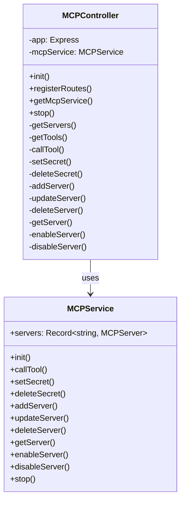
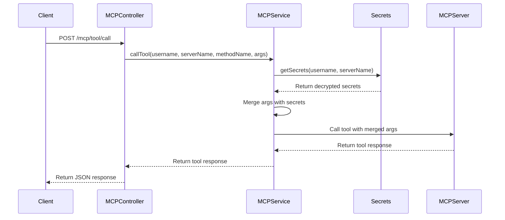
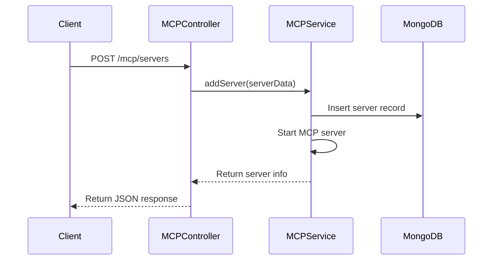

# Architecture: MCP Controller

## Context
The MCP Controller is a core component of the MCP API, responsible for managing MCP servers and exposing their functionality through a RESTful API. It handles server lifecycle, tool operations, and secret management integration.

## Goal
Provide a robust, maintainable interface for clients to interact with MCP servers, while ensuring proper error handling, security, and scalability.

## Component Design

## API Endpoints

The MCP Controller exposes the following RESTful API endpoints:

### MCP Server Management
- `GET /mcp/servers` - List all MCP servers
- `GET /mcp/servers/:name` - Get a specific MCP server
- `POST /mcp/servers` - Add a new MCP server
- `PUT /mcp/servers/:name` - Update an existing MCP server
- `DELETE /mcp/servers/:name` - Delete an MCP server
- `PUT /mcp/servers/:name/enable` - Enable an MCP server
- `PUT /mcp/servers/:name/disable` - Disable an MCP server

### MCP Tool Operations
- `GET /mcp/tools` - List all available MCP tools
- `POST /mcp/tool/call` - Call an MCP tool

### Secret Management
- `POST /secrets/set` - Set a secret
- `POST /secrets/delete` - Delete a secret

## Data Flow

### Tool Call Flow

### Server Management Flow

## Error Handling

The MCP Controller implements comprehensive error handling:

1. **Request Validation** - Validates incoming requests and returns appropriate error responses
2. **Service Errors** - Catches and logs errors from the MCPService
3. **HTTP Status Codes** - Returns appropriate HTTP status codes for different error conditions:
   - 400 Bad Request - Invalid request parameters
   - 404 Not Found - Server or tool not found
   - 500 Internal Server Error - Unexpected errors

## Security Considerations

1. **Input Validation** - All request parameters are validated before processing
2. **Secret Handling** - Secrets are never exposed in responses or logs
3. **User Isolation** - Each user's secrets are isolated and only accessible to that user

## Implementation Details

### MCPController Class

The `MCPController` class is responsible for:

1. **Route Registration** - Registers all API endpoints with the Express application
2. **Request Handling** - Processes incoming HTTP requests and returns appropriate responses
3. **Service Integration** - Delegates business logic to the MCPService

### Key Methods

- `init()` - Initializes the controller and its dependencies
- `registerRoutes()` - Registers all API endpoints with the Express application
- `callTool()` - Handles tool call requests
- `setSecret()` - Handles secret setting requests
- `deleteSecret()` - Handles secret deletion requests

## Considerations/Open Questions

- Should we implement rate limiting for tool calls?
- How to handle long-running tool operations?
- Should we implement a more robust authentication system?
- How to handle versioning of the API?

## AI Assistance Notes
- Model Used: Claude 3 Opus
- Prompt: Nexus System onboarding for MCP API project
- Date Generated: 2025-03-23

## Related Nexus Documents
- [System Overview](./system_overview.md)
- [Packages Controller](./packages_controller.md)
- [Secret Management](./secret_management.md)
- [Multi-user Support Feature](../features/multi_user_support.md)
