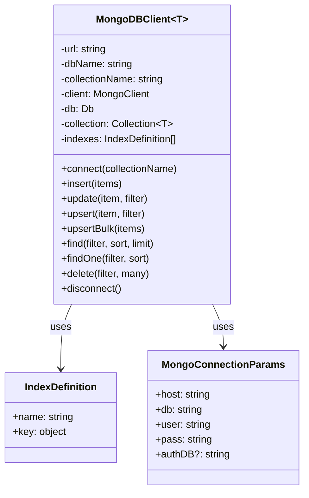

# Architecture: MongoDB Integration

## Context
MCP API uses MongoDB as its primary data store for persisting server configurations, package information, and encrypted secrets. The MongoDB integration is designed to be flexible, efficient, and maintainable, with proper indexing and error handling.

## Goal
Provide a robust, type-safe interface for interacting with MongoDB that supports the various data storage needs of the MCP API while ensuring proper performance and reliability.

## Component Design



## Data Models

The MCP API uses several MongoDB collections to store different types of data:

### MCP Servers Collection
Stores information about registered MCP servers:

```typescript
interface MCPServer {
  name: string;
  command: string;
  args: string[];
  env: Record<string, string>;
  status: 'connected' | 'connecting' | 'disconnected' | 'error';
  enabled: boolean;
  errors?: string[];
}
```

### Packages Collection
Stores information about installed MCP server packages:

```typescript
interface PackageInfo {
  name: string;
  version: string;
  installPath: string;
  main?: string;
  status: 'installed' | 'installing' | 'error';
  installed: Date;
  lastUsed?: Date;
  error?: string;
  mcpServerId?: string;
  enabled?: boolean;
}
```

### App State Collection
Stores application state information:

```typescript
interface AppState {
  firstRunCompleted: boolean;
  installedPackages: InstalledPackage[];
}

interface InstalledPackage {
  repo: string;
  serverName: string;
  uninstalled: boolean;
}
```

### Secrets Collection
Stores encrypted user secrets:

```typescript
interface UserSecret {
  username: string;
  server: string;
  key: string;
  value: string; // Encrypted value
}
```

## Database Operations

The `MongoDBClient` class provides a generic interface for interacting with MongoDB collections:

### Connection Management
- `connect(collectionName)` - Connects to MongoDB and selects a collection
- `disconnect()` - Closes the MongoDB connection

### CRUD Operations
- `insert(items)` - Inserts one or multiple documents
- `update(item, filter)` - Updates a document based on a filter
- `upsert(item, filter)` - Updates a document or inserts it if it doesn't exist
- `upsertBulk(items)` - Performs bulk upsert operations
- `find(filter, sort, limit)` - Retrieves documents based on a filter
- `findOne(filter, sort)` - Retrieves a single document based on a filter
- `delete(filter, many)` - Deletes documents based on a filter

## Indexing Strategy

Each collection has a set of indexes defined to optimize query performance:

### MCP Servers Collection
```typescript
const mcpIndexes = [
  { name: 'name', key: { name: 1 } }
];
```

### Packages Collection
```typescript
const packageIndexes = [
  { name: 'name', key: { name: 1 } }
];
```

### App State Collection
```typescript
const appStateIndexes = [
  { name: 'firstRunCompleted', key: { firstRunCompleted: 1 } }
];
```

### Secrets Collection
```typescript
const userSecretIndexes = [
  { name: 'username', key: { username: 1 } },
  { name: 'key', key: { key: 1 } },
  { name: 'username_key', key: { username: 1, key: 1 } }
];
```

## Error Handling

The MongoDB integration includes comprehensive error handling:

1. **Connection Errors** - Logs errors when connecting to MongoDB fails
2. **Query Errors** - Propagates errors from MongoDB operations to the caller
3. **Retry Logic** - Implements retry with exponential backoff for transient errors

## Implementation Details

### MongoDBClient Class

The `MongoDBClient<T>` class is a generic class that provides a type-safe interface for interacting with MongoDB collections. It takes a type parameter `T` that represents the document type for the collection.

Key features:

1. **Type Safety** - Ensures that documents inserted into and retrieved from MongoDB match the expected type
2. **Automatic Indexing** - Creates indexes if they don't exist
3. **Collection Creation** - Creates collections if they don't exist
4. **Connection Management** - Handles connection lifecycle

### Connection Parameters

The `MongoConnectionParams` interface defines the parameters needed to connect to MongoDB:

1. **host** - The MongoDB host (e.g., `localhost:27017`)
2. **db** - The database name
3. **user** - The MongoDB username
4. **pass** - The MongoDB password
5. **authDB** - (Optional) The authentication database

## Considerations/Open Questions

- Should we implement connection pooling for better performance?
- How to handle MongoDB schema migrations?
- Should we implement a caching layer for frequently accessed data?
- How to handle MongoDB replica sets and sharding?

## AI Assistance Notes
- Model Used: Claude 3 Opus
- Prompt: Nexus System onboarding for MCP API project
- Date Generated: 2025-03-23

## Related Nexus Documents
- [System Overview](./system_overview.md)
- [Secret Management](./secret_management.md)
- [MCP Controller](./mcp_controller.md)
- [Packages Controller](./packages_controller.md)
