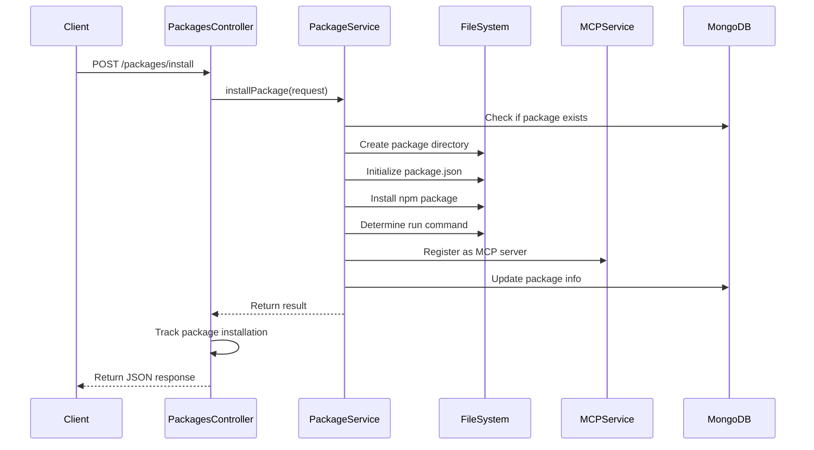
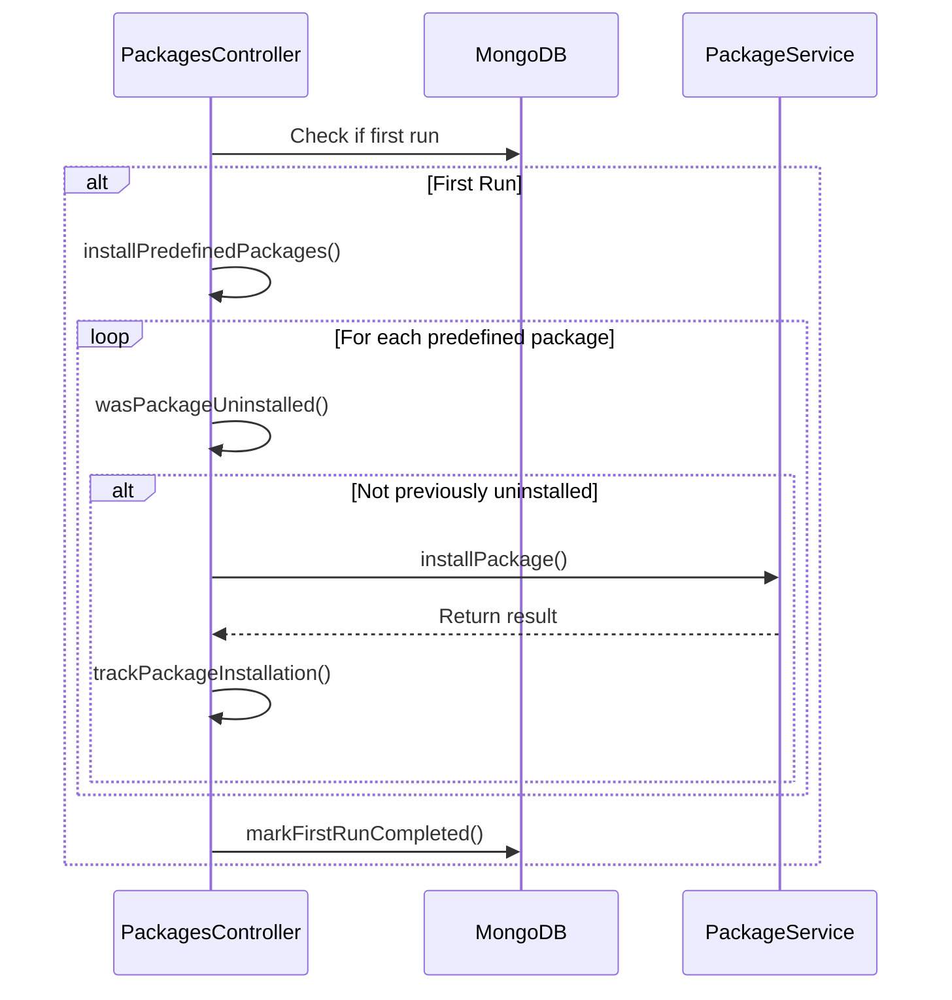

# Architecture: Packages Controller

## Context
The Packages Controller is responsible for managing MCP server packages, including installation, configuration, and lifecycle management. It provides a simplified interface for users to install and manage MCP servers without having to deal with the complexities of manual installation and configuration.

## Goal
Provide a robust, user-friendly system for managing MCP server packages, ensuring proper installation, configuration, and lifecycle management.

## Component Design

```mermaid
classDiagram
    class PackagesController {
        -app: Express
        -packageService: PackageService
        -appStateDBClient: MongoDBClient~AppState~
        +init()
        +registerRoutes()
        +getPackageService()
        +stop()
        -isFirstRun()
        -markFirstRunCompleted()
        -installPredefinedPackages()
        -wasPackageUninstalled()
        -trackPackageInstallation()
        -markPackageAsUninstalled()
        -installPackage()
        -getPackages()
        -getPackage()
        -getPackageById()
        -uninstallPackage()
        -enablePackage()
        -disablePackage()
    }
    
    class PackageService {
        -packagesDir: string
        -packagesDBClient: MongoDBClient~PackageInfo~
        -mcpService: MCPService
        +init()
        +installPackage()
        +getPackages()
        +getPackage()
        +getPackageById()
        +enablePackage()
        +disablePackage()
        +uninstallPackage()
        +stop()
        +installMissingPackage()
    }
    
    class AppState {
        +firstRunCompleted: boolean
        +installedPackages: InstalledPackage[]
    }
    
    class InstalledPackage {
        +repo: string
        +serverName: string
        +uninstalled: boolean
    }
    
    PackagesController --> PackageService : uses
    PackagesController --> "MongoDBClient~AppState~" : uses
    PackageService --> "MongoDBClient~PackageInfo~" : uses
    PackageService --> MCPService : uses
```

## API Endpoints

The Packages Controller exposes the following RESTful API endpoints:

### Package Management
- `POST /packages/install` - Install a new MCP server package
- `GET /packages` - List all installed packages
- `GET /packages/by-name/:name` - Get a package by name
- `GET /packages/by-id/:name` - Get a package by server ID
- `DELETE /packages/:name` - Uninstall a package
- `PUT /packages/:name/enable` - Enable a package
- `PUT /packages/:name/disable` - Disable a package

## Data Flow

### Package Installation Flow



### First Run Flow



## Error Handling

The Packages Controller implements comprehensive error handling:

1. **Request Validation** - Validates incoming requests and returns appropriate error responses
2. **Service Errors** - Catches and logs errors from the PackageService
3. **HTTP Status Codes** - Returns appropriate HTTP status codes for different error conditions:
   - 400 Bad Request - Invalid request parameters
   - 404 Not Found - Package not found
   - 500 Internal Server Error - Unexpected errors

## Security Considerations

1. **Input Validation** - All request parameters are validated before processing
2. **Package Name Validation** - Package names are validated to prevent command injection
3. **File System Isolation** - Package files are isolated in a dedicated directory

## Implementation Details

### PackagesController Class

The `PackagesController` class is responsible for:

1. **Route Registration** - Registers all API endpoints with the Express application
2. **Request Handling** - Processes incoming HTTP requests and returns appropriate responses
3. **Service Integration** - Delegates business logic to the PackageService
4. **First Run Handling** - Manages the first run process, including installing predefined packages
5. **Package Tracking** - Tracks installed packages and their status

### AppState Management

The `AppState` is used to track:

1. **First Run Status** - Whether the first run has been completed
2. **Installed Packages** - A list of installed packages and their status
3. **Uninstallation Tracking** - Tracks which packages have been uninstalled to prevent auto-reinstallation

### Key Methods

- `init()` - Initializes the controller and its dependencies, handles first run
- `registerRoutes()` - Registers all API endpoints with the Express application
- `installPackage()` - Handles package installation requests
- `uninstallPackage()` - Handles package uninstallation requests
- `enablePackage()` - Handles package enabling requests
- `disablePackage()` - Handles package disabling requests

## Considerations/Open Questions

- How to handle package versioning and updates?
- Should we implement a more robust package dependency management system?
- How to handle conflicts between packages?
- Should we implement a package repository for custom MCP servers?

## AI Assistance Notes
- Model Used: Claude 3 Opus
- Prompt: Nexus System onboarding for MCP API project
- Date Generated: 2025-03-23

## Related Nexus Documents
- [System Overview](./system_overview.md)
- [MCP Controller](./mcp_controller.md)
- [Package Management Feature](../features/package_management.md)
