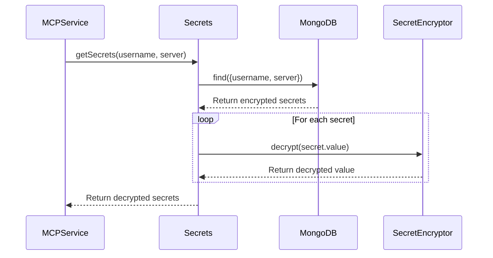
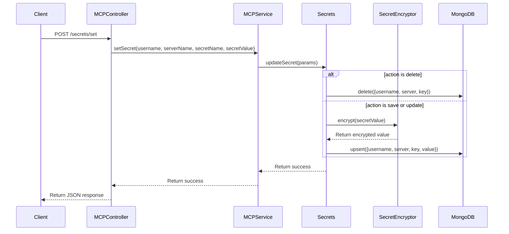
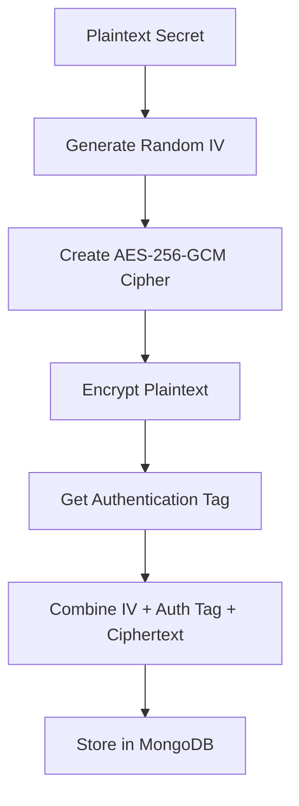

# Architecture: Secret Management

## Context
MCP servers often require sensitive credentials (API keys, passwords, tokens) to function properly. Traditional MCP server implementations store these credentials directly in environment variables, which presents security risks and limits multi-user capabilities. The Secret Management component addresses these limitations by providing a secure, user-specific way to store and retrieve sensitive credentials.

## Goal
Create a secure, scalable system for managing sensitive credentials that supports multi-user access to MCP servers while maintaining proper isolation and encryption of secrets.

## Component Design

```mermaid
classDiagram
    class Secrets {
        -secrets: SecretEncryptor
        -secretsDBClient: MongoDBClient~UserSecret~
        +init()
        +getSecrets(username, server)
        +updateSecret(params)
    }
    
    class SecretEncryptor {
        -key: Buffer
        -algorithm: string
        +encrypt(plaintext)
        +decrypt(data)
    }
    
    class UserSecret {
        +username: string
        +server: string
        +key: string
        +value: string
    }
    
    Secrets --> SecretEncryptor : uses
    Secrets --> "MongoDBClient~UserSecret~" : uses
```

## Data Flow

### Secret Retrieval Flow



### Secret Update Flow



## Encryption Details

The Secret Management component uses AES-256-GCM (Galois/Counter Mode) for encryption, which provides both confidentiality and authentication:

1. **Key Derivation** - The encryption key is derived from a master key using SHA-256
2. **IV Generation** - A random 12-byte Initialization Vector (IV) is generated for each encryption operation
3. **Authentication** - GCM provides built-in authentication with an authentication tag
4. **Format** - Encrypted data is stored in the format `iv:authTag:ciphertext` (all in hexadecimal)



## Security Considerations

1. **Encryption Key Management** - The master encryption key is stored in environment variables, not in the database
2. **User Isolation** - Each user's secrets are isolated and only accessible to that user
3. **Minimal Exposure** - Decrypted secrets are only held in memory temporarily during tool calls
4. **No Logging** - Secret values are never logged or exposed in responses

## Implementation Details

### Secrets Class

The `Secrets` class is responsible for:

1. **Secret Retrieval** - Retrieving and decrypting secrets for a specific user and server
2. **Secret Management** - Adding, updating, and deleting secrets
3. **Database Integration** - Storing encrypted secrets in MongoDB

### SecretEncryptor Class

The `SecretEncryptor` class is responsible for:

1. **Encryption** - Encrypting plaintext secrets using AES-256-GCM
2. **Decryption** - Decrypting encrypted secrets
3. **Key Management** - Deriving encryption keys from the master key

### UserSecret Schema

The `UserSecret` schema defines the structure of stored secrets:

1. **username** - The username of the secret owner
2. **server** - The MCP server the secret belongs to
3. **key** - The name of the secret
4. **value** - The encrypted secret value

## Considerations/Open Questions

- Should we implement key rotation for enhanced security?
- How to handle master key backup and recovery?
- Should we implement a more robust authentication system?
- How to handle secret sharing between users (if needed)?

## AI Assistance Notes
- Model Used: Claude 3 Opus
- Prompt: Nexus System onboarding for MCP API project
- Date Generated: 2025-03-23

## Related Nexus Documents
- [System Overview](./system_overview.md)
- [MCP Controller](./mcp_controller.md)
- [Secure Secret Management Feature](../features/secure_secret_management.md)
