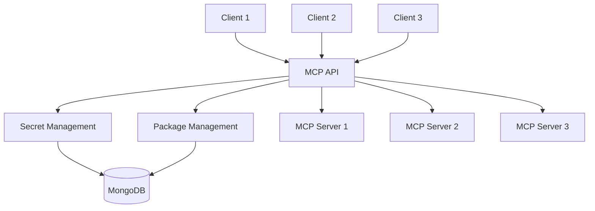
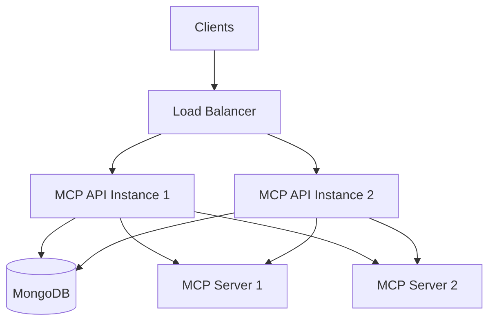

# Architecture: System Overview

## Context
MCP API is designed to address limitations in the current Model Context Protocol (MCP) server ecosystem, particularly around security and multi-user support. Most MCP servers are designed for single-user usage with secrets stored directly in environment variables, which presents security risks and scalability challenges.

## Goal
Create a scalable, secure architecture that enables multiple users to access the same MCP server instances while properly managing sensitive credentials and simplifying the installation and configuration of MCP servers.

## Architecture Overview

MCP API acts as a proxy between clients and MCP servers:

### Key Components

1. **HTTP API Layer**
   - Exposes a RESTful API for clients to interact with MCP servers
   - Handles authentication and authorization
   - Routes requests to appropriate MCP servers
   - Manages server lifecycle

2. **Secret Management**
   - Securely stores and retrieves user-specific secrets
   - Uses AES-256-GCM encryption for all stored secrets
   - Isolates secrets by user and server
   - Injects secrets into MCP server requests as needed

3. **Package Management**
   - Handles installation, configuration, and lifecycle of MCP server packages
   - Provides a unified interface for managing MCP servers
   - Supports auto-installation of predefined packages
   - Tracks installed packages and their status

4. **MCP Server Communication**
   - Communicates with MCP servers using the Model Context Protocol
   - Manages server connections and lifecycle
   - Handles errors and reconnection
   - Provides a unified interface for tool operations

5. **Database Layer**
   - Stores encrypted secrets, server configurations, and package information
   - Uses MongoDB for persistence
   - Implements proper indexing for efficient queries

## Data Flow

1. **Client Requests**: Applications send requests to the HTTP API
2. **Authentication**: The API validates the request and identifies the user
3. **Secret Retrieval**: If needed, the API retrieves and decrypts user-specific secrets
4. **MCP Server Communication**: The API forwards the request to the appropriate MCP server
5. **Response Handling**: Results from MCP servers are returned to clients

## Security Considerations

- All secrets are encrypted using AES-256-GCM before storage
- Each user's secrets are isolated and encrypted separately
- The encryption key is stored in environment variables, not in the database
- The API should be deployed behind HTTPS in production

## Scalability Considerations

- The architecture supports multiple users accessing the same MCP server instances
- MongoDB can be scaled horizontally for increased load
- The API can be deployed in a containerized environment for easy scaling

## Deployment Architecture

## API Considerations
- [Detailed API Reference](./api_reference.md)

## Code Structure

The codebase is organized into the following main directories:

- `src/controllers/`: HTTP API controllers
- `src/services/`: Core business logic services
- `src/utils/`: Utility functions and helpers

## Considerations/Open Questions
- How to handle MCP server versioning and updates?
- Should we implement a more robust authentication system?
- How to handle rate limiting and quota management?
- Should we implement a caching layer for frequently used MCP server responses?

## AI Assistance Notes
- Model Used: Claude 3 Opus
- Prompt: Nexus System onboarding for MCP API project
- Date Generated: 2025-03-23

## Related Nexus Documents
- [Decision Log](../decisions/decision_log.md)
- [MCP Controller](./mcp_controller.md)
- [Packages Controller](./packages_controller.md)
- [Secret Management](./secret_management.md)
- [MongoDB Integration](./mongodb_integration.md)
